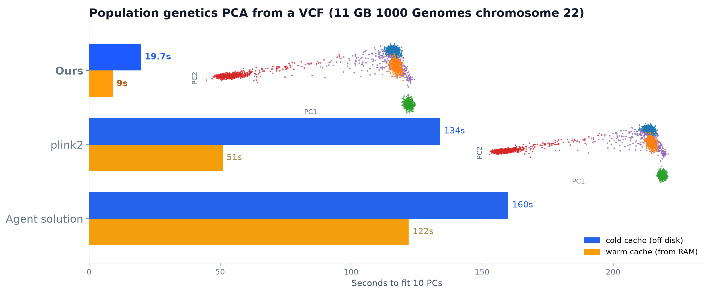

# pcabench

An RL environment / eval for building a **fast, from-scratch population-genetics PCA** over
raw, unindexed VCFs — in pure Python, no genomics or PCA libraries.

The agent writes one program, `pca <vcf> <k> <out.tsv>`, that reads a large multi-sample VCF
off disk and emits the top-`k` principal components of population structure (an HWE-normalised
Patterson-Price-Reich PCA). It is scored on three axes at once:

- **accurate?** — does its PC subspace match the ground-truth subspace (naive = 0, full-coverage
  scoring anchor = 1)?
- **fast?** — does it fit about as fast as the anchor, or faster?
- **genuine?** — is it *actually* an HWE-normalised PCA with adequate marker coverage, or an
  accurate-looking impostor (a plain covariance PCA, an undersampled fit, a non-PCA)?

The bounded score makes both scientific fidelity and systems performance load-bearing. Scientific
accuracy is always a multiplicative ceiling; among accurate fits, the runtime term separates a
slow exact scan from a fast faithful approximation. Private method checks continuously discount
nearby-but-wrong objects. Only dependency or output-contract violations are invalid evaluations.

**The reference solution is [`reference/fast_pca.py`](reference/fast_pca.py)** — one
self-contained file, the fast systems-level PCA the agent should aspire to. The full-scan
implementation is *not* a solution the agent competes with; it is the grader's internal
**scoring anchor** that defines the ground-truth subspace and the speed to beat.



*The reference computes the same continental PCA of the real 11 GB 1000 Genomes chromosome 22 as
`plink2` and a full scan — the identical AFR/AMR/EAS/EUR/SAS structure — in a small fraction of the
time, because it reads only a fraction of the file.*

## Why it's a good task

The skill being trained is real and layered: parse a gigabyte of unindexed VCF text, do the
numerically-correct Patterson standardisation, take the eigendecomposition — and make it
*fast*. Speed is not a footnote; it is the point. A correct full scan of the real 11 GB 1000G
chr22 takes **~122 s** warm (≈160 s cold). The reference implementation recovers the **same** PC
subspace (**0.978** subspace accuracy, every structured PC1–8 at |corr| ≥0.98) and the **same
AFR/AMR/EAS/EUR/SAS continental clustering** in **~9 s** warm (≈20 s cold) — **~13× faster warm,
~8× cold** than a full scan — reading only ~**20 %** of the file — by exploiting the structure of
the problem:

- population structure needs only tens of thousands of LD-independent markers, not millions,
  so you can **sample variants by random byte offset** instead of reading the whole file;
- the OS lets you `lseek`/`pread` to any offset, and `posix_fadvise(MADV_RANDOM)` stops the
  kernel from reading ahead into data you throw away;
- `pread` from a thread pool drops the GIL, so block reads fly concurrently;
- because samples ≪ variants, the sample-by-sample **Gram matrix** (`n × n`) gives the exact
  PCs far cheaper than an SVD of the full genotype matrix, and it never leaves cache;
- the last mile is profiling: batch-decode a whole block's genotypes in one strided numpy pass
  (not per line), compute allele frequencies in integer and convert only kept variants to float,
  accumulate the Gram in **float32** with a symmetric rank-k update (`ssyrk` — half a general
  matmul's FLOPs, one triangle, in place), and take the top-k via an **exact range
  eigensolver** (LAPACK `dsyevr`, which computes only the requested k eigenpairs) instead of a
  full O(n³) `eigh` — exact *and* cheap at realistic sample counts.

The task is **pure Python** (numpy + scipy only — `numba`, `cython`, native extensions, and
every other third-party package are banned and enforced by the grader). The speed must come
from the algorithm and from numpy/BLAS, not from dropping to another language.

**How hard the speed was pushed — and where the floor is.** The reference was taken to the
*proven* pure-numpy optimum, not just a fast-enough point. The Gram's float32 `ssyrk` (a
multi-threaded symmetric rank-k update) is the dominant compute and the BLAS floor — no language
beats OpenBLAS. Every escape from it was built and measured and **rejected with data** (see
`scripts/experiments/`):
matrix-free randomized SVD (loses: must materialise the design), streaming / one-pass sketches
(fail on *subtle* structure — cc 0.93 — because a small eigengap needs the full spectrum or
power iterations = extra file passes), leverage/importance sampling (HWE standardisation makes
leverage flat, CV 0.037), int8/low-precision Gram (numpy has no integer GEMM; the per-variant
weight forces float), incremental PCA (Oja under-accurate, Frequent-Directions 165× slower),
Sobol offsets (systematic already is the optimal low-discrepancy sampler), and bit-packed
popcount (no fused popcount-matmul in numpy). The Gram is a **one-pass sufficient statistic** —
that is *why* it wins, and having proven it is more useful than having assumed it. A regime
auto-switch to matrix-free covers the one case the Gram loses: biobank-scale `n > n_variants`.

That regime is **graded**, not hypothetical. The `biobank` arm has 64 000 samples and 2 000
markers, so the sample Gram everyone reaches for first is **32.8 GB in float64 and 16.4 GB in
float32** — past the address-space and resident-memory limits both — while the algebraically
identical marker-space decomposition of the same Patterson object needs about 1 GB. The VCF itself
is a cheap ~0.5 GB, so what the arm actually costs is nothing and what it actually tests is whether
you reasoned about the shape of your own intermediates before allocating them. A correct program
that never asks "how big is this matrix?" does not merely score badly there; it does not run.

That is the ladder from a naive full scan to the "fast as fuck" reference — and the reward
surface encodes exactly the tension the agent must resolve: sample too few variants and you're
fast but noisy; scan everything and you're accurate but slow.

## Validated behaviour

Measured through the real grading path:

| Submission | Accuracy | Speed | Current bounded score |
|---|---|---|---|
| `reference/fast_pca.py` on **real 1000G chr22** (11 GB, 2504 samples, 1.05M variants) | 0.978 (PC1–8 ≥0.98) | **~9 s vs 122 s → ~13× warm** (20 s vs 160 s → 8× cold); same AFR/AMR/EAS/EUR/SAS clustering | **~0.98** |
| profiling wins (batched decode + float32 Gram + exact top-k eigh) | — | chr22 fit sped up ~4× over the naive per-line parse | — |
| `fn_resistance/` (independent correct full scan) | ~1.0 scientific accuracy and gates | full-scan parity | **~0.65** |
| `cheats/raw_covariance` (no HWE norm) | high | — | **0.00** (hwe_norm gate) |
| `cheats/undercoverage_200snp` (too few SNPs) | high on easy data | fast | **≤0.12** (coverage gate) |
| `cheats/format_fragile` (real PCA, brittle parser) | genuine on clean GT | — | **≤0.40 overall and ≤0.05 in each parser-stress category** |
| `cheats/sklearn_pca` (forbidden library) | — | — | **0.00** (library scan) |
| `cheats/{random,constant,first_k}` | ~0 | — | **0.00** |

The two standing guarantees, enforced by `scripts/validate.py`:

- **a genuine PCA is never misidentified** — `fn_resistance/` retains accuracy and method factors
  ≥ 0.9 even though its deliberately unoptimised runtime earns only partial systems credit;
- **every known shortcut is bounded on the axis it cheats** — wrong-object and undercoverage
  programs score ≤ 0.15 in every category; the format-fragile but mathematically genuine PCA
  scores ≤ 0.40 overall and ≤ 0.05 in each parser-stress category. Its clean-format credit is
  intentionally preserved rather than mislabeled as a parser bypass.

### Rollout evidence

Claude Opus 4.8 rollout `run_019f5a30-9830-711b-8f9d-9f14915c5d7f` recovered every
graded dataset at accuracy ≥ 0.9997 with every identity/validity gate at 1. The
legacy continuous reward was 0.935812 because per-dataset speed factors ranged from
0.876 to 1.040. That score is valid evidence of a **model optimization gap**: the
solution was accurate and genuine but slower than the fast reference. The old
environment wrapper nevertheless marked two categories partial through an
unreviewed status threshold and reported 0 ms for four categories because it timed
reporting callbacks instead of the grader. Those were **reward-reporting bugs**.
The current bounded reward and component-wise mastery contract were introduced after
that rollout. Scientific and systems weaknesses retain continuous partial credit, while a
category passes only after its accuracy floor, its method invariants, and (where applicable) its
calibrated systems floor are all demonstrated. A systems floor is placed on a category only where
being faster than a full scan is demonstrable on that fold -- the large folds and real data, where
reading a fraction of the file genuinely wins -- and is set a safe margin below the reference fast
solution's measured work-time quality there, so a parity full scan never masters those folds yet the
bar stays reachable. On the smaller folds the sampling win is not yet realizable (the fast reference
is only at parity), so those categories are mastered on accuracy and method invariants -- their real
capabilities. Status is a monotone function of the category's own accuracy and systems quality.
Every result carries real grader timings, sampled
primary-invocation peak PSS and temporary-storage use, and per-dataset diagnostics. These resource
diagnostics exclude probe invocations, and an unexecuted deadline row uses `null` rather than
claiming a measured zero.

## How fast is it, really? (vs the standard tools)

The reference isn't just fast against its own full-scan anchor — it beats the tools a geneticist
would actually reach for. Measured head-to-head on **one idle machine**, same real **11 GB 1000
Genomes chr22** VCF, computing the same object (an HWE-normalised Patterson PCA), from **VCF on
disk → PC scores**, at both cold and warm page cache (the figure at the top of this README):

- **It computes the same PCA.** The scatter panels are ours vs `plink2` — the same
  AFR/AMR/EAS/EUR/SAS structure, every structured PC recovered (subspace accuracy **0.978**;
  per-PC |corr| with the exact subspace **≥0.98 for PC1–8**, and a population-clustering agreement
  of 0.998 vs the full scan).
- **It's dramatically faster wall-clock.** Warm cache: **~9 s** vs `plink2` 51 s (**~5.7×**) and vs
  a correct full scan 122 s (**~13×**). Cold cache: **~20 s** vs 134 s (**~6.8×**) and vs 160 s
  (**~8×**).
- **Because it reads a fraction of the file.** `fast_pca` samples ~**20 %** of the file (a fixed
  ~200k-marker budget by random byte offset — 208k markers kept) where plink2 and a full scan each
  stream the **whole 11.2 GB**. (Disk-bytes-read is measured via `/usr/bin/time -v` and is independent of machine
  load, so it is the rigorous headline; absolute wall-clocks are machine-dependent but the ratios
  are stable.)

Reproduce with `scripts/bench_vs_tools.py` (adapter-based: ours, plink2 exact/approx, plink1.9,
scikit-allel, full-scan anchor); methodology and provenance in
[`docs/benchmark_vs_tools.md`](docs/benchmark_vs_tools.md).

## Layout

| Path | What |
|---|---|
| `hyperfocal.yaml`, `environment/` | runnable Hyperfocal wrapper; problem id `from_scratch_pca`, Opus 4.8, kernel-enforced `linux-user` solve isolation |
| `tasks/from_scratch_pca/` | packaged Harbor task with separate agent and sealed verifier images; the latter privately keys and derives the observed arm |
| `reference/fast_pca.py` | **the reference solution** — single-file "fast as fuck" PCA (`pread` + fadvise + random-block sampling + dense Gram) |
| `reference/full_scan_pca.py` | the grader's **scoring anchor**: defines the ground-truth subspace + the 1.0 speed baseline (not an agent-facing solution) |
| `reference/pca_core.py` | shared Patterson math (standardise → Gram → eigh) |
| `grader/grade.py` | composes bounded scientific/resource quality, rolls up per category |
| `grader/metrics/subspace.py` | structure-weighted subspace-agreement accuracy (naive 0, scoring anchor 1) |
| `grader/metrics/structure.py` | population-structure recovery vs known labels (nearest-centroid, η²) |
| `grader/gates/` | `library_scan`, and probe-driven `hwe_norm` / `coverage` identity gates |
| `data/generate.py` | Balding-Nichols synthetic VCFs with planted structure + ground truth |
| `data/prepare_1kg.py` | real 1000 Genomes chromosome → release-stable graded cohort with privately keyed opaque representation and hierarchical truth |
| `cheats/` | one program per known hack (must score ≈ 0) |
| `fn_resistance/` | an independent correct full scan (must preserve scientific accuracy and gates; runtime remains partial) |
| `scripts/validate.py` | asserts both guarantees through the real grading path |
| `scripts/experiments/` | the optimization sweep: one isolated experiment + numeric verdict per algorithmic lever, and a README of what was tried and why it was kept or rejected |

## The reward, precisely

Per dataset:

    reward = accuracy × (0.10 + 0.90 × systems_unlock(accuracy) × time_quality)
                      × ∏(effective method factors)

- **accuracy** ∈ [0, 1]: each anchor PC direction is projected onto the submission's score
  subspace and weighted by how far its eigenvalue rises above the Marchenko-Pastur noise bulk,
  so only genuinely structured axes count. Normalised: random = 0, full-scan scoring anchor = 1.
- **systems_unlock(accuracy)** ∈ [0, 1]: accuracy *unlocks* the speed term rather than merely
  scaling it. A PCA that does not recover the structure has not computed the thing being timed, so
  its wall clock measures nothing: below accuracy 0.75 the speed term is worth zero and no amount of
  optimization moves the score, ramping to fully paid at 0.90. Because genuine implementations
  saturate at accuracy 1.000 (and `scripts/validate.py` pins 0.90 as the worst a real PCA may
  score), the ramp is invisible to honest submissions and bites only wrong ones. It buys the
  property a plain `accuracy × speed` product does not: **wrong-and-fast is strictly worse than
  right-and-slow, at every speed.** A broken PCA is capped at `accuracy × 0.10`, beneath the 0.10 a
  correct-but-slow fit earns; under the old product, accuracy 0.5 with perfect speed banked 0.50 —
  five times what a scientifically perfect but slow fit was paid.
- **systems quality** ∈ [0, 1]: end-to-end speed scored against what is *achievable on that fold*.
  Two anchors are measured per dataset — the **full scan** (a correct naive implementation → 0.5)
  and the **fast reference** (the best speed shown to be reachable → 1.0) — interpolated in
  log-time. All three programs run through the identical sandbox, and the same measured fixed
  execution baseline is removed from each, so work is compared with work. A program running the
  fast reference's exact code therefore scores exactly 1.0. How much speed is available is a property of the *fold*,
  not a constant: on a large VCF the fast reference reads a fraction of the file and wins big, while
  on a small one its sampling overhead costs more than the I/O it avoids and a plain scan is already
  optimal. So a fixed "8× faster than a full scan → 1.0" scale was unearnable by *any* correct
  program on most folds and capped even a perfect solution below a reward of 1. Under the achievable
  normalization, matching the best achievable speed scores 1.0 on every fold; where sampling wins a
  full scan sits at 0.5 and you must skip work; where it cannot win, the full scan *is* optimal and
  scores 1.0 — nothing is punished for failing to achieve a speedup that does not exist. This
  rewards picking the right strategy per fold. Scientific agreement remains a multiplicative
  ceiling. Submission and reference time on the private method carriers is measured too and
  amortized across scored folds, so doing an intentionally slow exact fit only on probes is not
  free. Both anchors and the shared-overhead calibration are mandatory evaluator state: an anchor
  failure errors the grade instead of being misreported as evidence that no speedup is achievable.
- **method factors** ∈ [0, 1]: `library_scan` (pure-Python enforcement), and object-identity checks
  driven by fixed-release carriers matched to complete active invocation and serialization
  profiles — `hwe_norm` (Patterson vs raw covariance), `coverage`
  (subtle structure a tiny-marker shortcut cannot resolve), and `representation_equivalence`
  (equivalent sample/record orders, allele polarity, case, phase, and FORMAT encodings).
  Genuine fits sit at severity 0 (dead-zoned). Dependency and validity failures can hard-zero;
  scientific method failures retain reviewed floors (0.15 for HWE/coverage and 0.35 for the
  narrower representation check) so algorithmic weaknesses remain low but nonzero. The
  representation factor applies to the `messy` and `variable_width` parser-stress categories;
  it does not erase otherwise-correct PCA credit on unrelated clean categories.

Datasets roll up by weighted mean within a category. Category means are then weighted by the
average reviewed dataset weight in that category, so the observed and harder challenge arms retain
their intended influence without letting a populous category dominate. The final reward remains
bounded on the same 0-to-1 scale. The private scientific arms include both equal-strength
high-rank recovery and a descending-spectrum selection case with identifiable axes beyond the
requested rank, so outputting plausible population structure is not enough when it is not the
leading `k` subspace.

## Run it

```bash
sudo /bin/bash environment/provision.sh
head -c 32 /dev/urandom > /tmp/pcabench-representation.key
sudo /opt/hyperfocal/pcabench/bin/python -m data.generate --suite dev \
  --math-key-file /opt/hyperfocal/pcabench-secrets/release-v3.math-key \
  --representation-key-file /tmp/pcabench-representation.key
sudo /opt/hyperfocal/pcabench/bin/python scripts/validate.py --data-dir data/generated \
  --math-key-file /opt/hyperfocal/pcabench-secrets/release-v3.math-key
```

Full-suite grading always requires root on provisioned Linux and an explicit reviewed isolation
mode. `scripts/validate.py` and the Hyperfocal adapter select bubblewrap. The packaged Harbor task
uses a separate no-network verifier image, transfers only the frozen submission artifact, and
selects the verifier-container privilege-drop contract. Neither path falls back to unconfined
execution.

### Production execution boundary

The grader stages only bounded regular submission files, seals the private reference, and freezes
one fd-verified snapshot before scanning or probing. Hyperfocal executes that snapshot through an
allowlisted bubblewrap filesystem with fresh user, PID, IPC, UTS, and network namespaces. Harbor's
outer verifier container has networking disabled and was never occupied by the solver; each child
additionally enters a static root-owned chroot containing the pinned runtime and invocation work
tree but no grader, datasets, `/proc`, `/sys`, or container-global filesystem.

The trusted launcher first installs a thread-synchronized seccomp filter that denies `execve` and
`execveat`, eagerly loads the reviewed NumPy/SciPy numerical paths, and then stacks a second filter
that denies new executable `mmap`, executable `mprotect`/`pkey_mprotect`, and executable System V
attachments. Thus decoded or renamed extensions cannot be mapped even if Python-level import
auditing is bypassed. A fail-closed audit hook still provides diagnostics for subprocess/system
calls, dynamic `ctypes` access, tracing or GC routes to the hook, and imports outside reviewed
immutable Python/NumPy/SciPy roots. Normal sibling pure-Python imports, data-only `mmap`, and Linux
`fork` workers remain available; every extant native thread and forked descendant inherits the
kernel policy.

Each invocation switches to a dedicated unprivileged uid, exposes only the required
runtime/input/output surface, and passes no verifier credentials. Input VCFs are staged to
distinct inodes with normalized timestamps, so source link counts and prior reference
reads cannot identify probes or categories. The container preflight also proves reads cannot
mutate the reusable immutable layer's access times. Completion and timeout cleanup
kills the process group and every detached process owned by that uid, removes its System V message
queues/semaphores/shared memory, and clears Harbor's writable chroot state before the next call.
Hostile logs are drained into a fixed-size diagnostic tail. Address-space, output-size, process,
descriptor, CPU, and wall-clock limits fail closed; a root monitor additionally enforces aggregate
proportional RSS and physical temporary-storage limits across forked workers.
